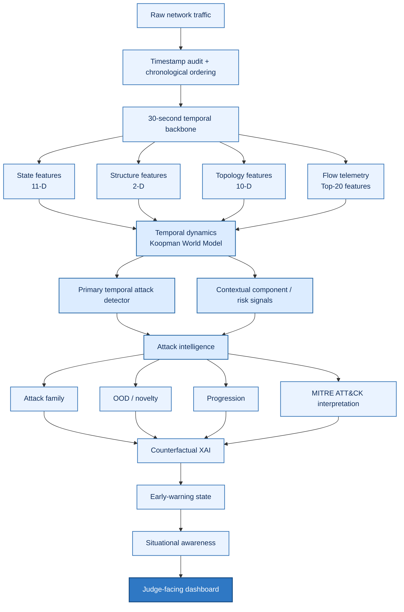
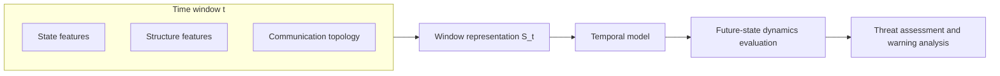

# DRISHTI — SIH 2026

### Dynamic Real-time Intelligence for Security via Heterogeneous Topology Inference


> [!IMPORTANT]
> ## Complete Research, Coding & Validation
>
> **The complete implementation, experiments, testing, and validation work for DRISHTI is documented in the three research notebooks below.** They contain the code, evaluation procedures, audit checks, and supporting outputs behind the project's research results.
>
> - **`DRISHTI_Book_1.ipynb` — Foundation & World Model:** Dataset discovery and preparation, temporal-window construction, network-state features, Delay-Koopman world modeling and forecasting benchmarks, Koopman analyses, topology/persistent-homology experiments, and temporal-integrity, statistical, and robustness validation.
> - **`DRISHTI_Book_2.ipynb` — Detection & Integrated Attack Intelligence:** CIC-IDS2018 detection pipeline and baselines, risk-signal and temporal-detector evaluation, attack-onset/forecasting audits, packet-telemetry experiments, cross-dataset validation, and integration/evidence checks.
> - **`DRISHTI_Book_3.ipynb` — TON-IoT Forecasting & Early Warning:** Dataset and temporal-integrity audits, feature construction, temporal dynamics, forecasting baselines and GRU experiments, event-level early-warning and lead-time evaluation, and exploratory time-to-event interval analysis.
>
> **Rendering note:** These notebooks are large and contain extensive code and outputs. GitHub may take **1–2 minutes** to render them; please allow a little time for them to load.

**DRISHTI** is a cybersecurity research and situational-awareness prototype developed for **Smart India Hackathon 2026**, Problem Statement **26153: “AI-Based Network Attack Forecasting from Network Traffic Data.”** It explores how temporal network representations and learned dynamics can support threat assessment, attack-related analysis, and early-warning research using public cybersecurity datasets.

---

## Contents

- [Project overview](#project-overview)
- [System at a glance](#system-at-a-glance)
- [What DRISHTI includes](#what-drishti-includes)
- [Research evidence](#research-evidence)
- [Dashboard modules](#dashboard-modules)
- [Repository structure](#repository-structure)
- [Run the dashboard](#run-the-dashboard)
- [Research notebooks and datasets](#research-notebooks-and-datasets)
- [Reproducibility and interpretation](#reproducibility-and-interpretation)
- [Limitations](#limitations)
- [Technology](#technology)
- [License](#license)

## Project overview

The problem statement calls for a system that learns how network behavior evolves over time and supports proactive cyber defense through future-state forecasting and interpretable decision support.

DRISHTI investigates this goal through time-windowed network representations, temporal modeling, threat-related analysis, and event-level early-warning evaluation. It combines research artifacts with a browser-based dashboard for exploring the approach, network behavior, and documented experimental findings.

| Field | Details |
|---|---|
| Project | DRISHTI |
| Event | Smart India Hackathon 2026 |
| Problem Statement ID | 26153 |
| Problem Statement | AI-Based Network Attack Forecasting from Network Traffic Data |
| Organization | National Technical Research Organisation (NTRO) |
| Domain | Cybersecurity and temporal network intelligence |
| Interface | React + TypeScript web dashboard |
| Research artifacts | Three Jupyter notebooks and a results manifest |

## System at a glance

The diagram below shows the end-to-end DRISHTI research architecture, from traffic preparation through temporal modeling, threat analysis, and dashboard presentation. The CIC-IDS2018 integrated prototype contains **16.23M flow records**, organized into **9,777 temporal windows**, **167 temporal segments**, and **216 attack onsets**.



### Conceptual network representation

DRISHTI organizes traffic observations into a time-dependent representation of network behavior. In the CIC-IDS2018 experiments, the representation includes state, structure, and communication-topology features; the topology is defined according to the experiment's protocol and destination-port representation.



These diagrams summarize the research workflow and conceptual data flow. Dataset-specific feature definitions, model configurations, and evaluation procedures are documented in the notebooks and Master Results Manifest.

## What DRISHTI includes

- **Temporal network representation:** Organizes traffic observations into time-based network-state representations.
- **Threat assessment:** Presents network-level threat context and representative evidence.
- **Temporal dynamics:** Examines how network signals evolve across consecutive windows.
- **Early-warning research:** Evaluates whether temporal signals can provide advance warning of attack onset under a defined protocol.
- **Attack intelligence:** Presents representative evidence windows and contextual attack information.
- **Ingestion replay:** Provides a replay-oriented view of the ingestion workflow.
- **Research integrity:** Documents evaluation safeguards, evidence boundaries, and limitations.

## Research evidence

The repository includes three research notebooks and a Master Results Manifest. The figures below are **dataset- and experiment-specific**; consult the notebooks and manifest for metric definitions, split details, and full experiment context.

### CIC-IDS2018 — temporal detection

The documented temporal GRU detector reports:

| Metric | Result |
|---|---:|
| PR-AUC | 0.683 |
| ROC-AUC | 0.797 |

The documented static logistic-regression baseline reports PR-AUC 0.371 and ROC-AUC 0.640. These figures describe the evaluated experiment and should not be interpreted as live-network performance.

The genuine attack-onset forecasting experiment on CIC-IDS2018 was not promoted as a successful forecasting result.

### UNSW-NB15 — dynamics validation

The independent temporal-dynamics experiment reports a **20.67% lower 30-second prediction MSE than the persistence baseline**. See the research artifacts for the exact protocol and values.

### TON-IoT — event-level early warning

The documented fixed-threshold evaluation reports:

| Measure | Result |
|---|---:|
| Test onset events detected | 13 of 14 (92.86%) |
| Median warning lead time | 120 seconds |
| Mean warning lead time | Approximately 126.9 seconds |
| Observed lead-time range | 30–300 seconds |

This result is based on a small event sample and a specific evaluation setup. It is not a guarantee of warning performance on live networks, a universal zero-day detection claim, or an exact time-to-compromise estimate.

**These metrics describe different tasks:** detection quality, state-dynamics prediction error, and event-level warning performance should be interpreted separately.

## Dashboard modules

The dashboard is organized into eight areas:

1. **Overview** — high-level situational summary.
2. **Network Representation** — time-based network representation and scenario context.
3. **Threat Assessment** — threat-related evidence and context.
4. **Temporal Dynamics** — evolution of signals over time.
5. **Forecast & Warning** — forecasting-related research evidence and warning views.
6. **Attack Intelligence** — representative evidence windows and contextual attack information.
7. **Ingestion Replay** — replay-oriented view of the ingestion flow.
8. **Research Integrity** — evaluation safeguards, evidence boundaries, and limitations.

### Scenario exploration

The interface includes **Normal**, **Known Attack**, and **Novel / Uncertain** illustrative scenarios to help users explore the dashboard's presentation of network conditions and threat-related context. Scenario selection is an interface-level exploration feature; it does not launch a new model-training or inference job. Benchmark results are reported separately in the research artifacts.

## Repository structure

```text
DRISHTI-SIH-2026/
├── README.md
├── .gitignore
├── dashboard/
│   ├── src/
│   │   ├── assets/
│   │   ├── components/
│   │   ├── data/
│   │   ├── landing/
│   │   ├── pages/
│   │   ├── types/
│   │   ├── App.tsx
│   │   ├── main.tsx
│   │   └── styles.css
│   ├── index.html
│   ├── package.json
│   ├── package-lock.json
│   └── tsconfig.json
└── research/
    ├── DRISHTI_Book_1.ipynb
    ├── DRISHTI_Book_2.ipynb
    ├── DRISHTI_Book_3.ipynb
    └── DRISHTI_Master_Results_Manifest.md
```

Keep the dashboard's source files and required configuration; do not commit dependency folders, build output, raw datasets, private documents, or credentials.

## Run the dashboard

### Prerequisites

- Node.js LTS compatible with the project dependencies
- npm
- Git

### 1. Clone the repository

```bash
git clone <YOUR_GITHUB_REPOSITORY_URL>
cd DRISHTI-SIH-2026
```

### 2. Install dependencies

```bash
cd dashboard
npm ci
```

If `npm ci` reports that the lockfile and package manifest are out of sync, resolve that issue locally and commit the corrected lockfile before using `npm ci`.

### 3. Start the development server

```bash
npm run dev
```

Open the local address printed by Vite in your terminal.

### 4. Build and preview

```bash
npm run build
npm run preview
```

The production build is generated in `dist/` and should normally remain out of version control.

## Research notebooks and datasets

The `research/` directory contains the three notebooks and `DRISHTI_Master_Results_Manifest.md`. The notebooks document the research workflow, experiments, and supporting evidence. They may depend on Python packages, dataset files, and environment-specific paths that are not included in this repository. A clean, end-to-end notebook run may require additional environment setup.

### Dataset access and usage

The research references public cybersecurity datasets, including **CIC-IDS2018**, **UNSW-NB15**, and **TON-IoT**. Obtain datasets from their respective official or authorized sources and follow their terms of use.

Raw datasets are not bundled with this repository. Do not redistribute dataset files unless their licenses and terms explicitly permit it. Dataset download links and access instructions should be checked before use.

## Reproducibility and interpretation

- Use the notebooks and results manifest as the source of truth for experiment-specific metrics and definitions.
- Preserve chronological evaluation boundaries where specified and avoid temporal leakage.
- Keep attack detection, future-state prediction, and attack-onset forecasting distinct.
- Interpret warning statistics using their stated event definitions, thresholds, and evaluation window.
- Distinguish measured research findings from illustrative scenario exploration and contextual interpretation.
- Do not describe benchmark results as guaranteed live-network performance.

## Limitations

- Results are bounded by the datasets, feature construction, split strategy, event definitions, and evaluation protocols used.
- Benchmark performance does not establish performance on live enterprise or critical-infrastructure networks.
- Scenario exploration is an interface feature and does not initiate fresh model inference.
- The documented TON-IoT warning result is based on 14 evaluated onset events.
- No universal zero-day detection guarantee or exact time-to-compromise prediction is claimed.
- DRISHTI is a research prototype and is not a production security control.

## Technology

| Area | Technologies |
|---|---|
| Dashboard | React, TypeScript, Vite, CSS |
| UI dependencies | lucide-react, OGL |
| Research | Python, Jupyter Notebook |
| Research datasets | CIC-IDS2018, UNSW-NB15, TON-IoT |

## License

No license is specified in this repository. Add a `LICENSE` file only after the team has chosen a license and confirmed that it is appropriate for the code and included materials. Without a license, others generally do not receive permission to reuse, modify, or distribute the project beyond applicable legal exceptions.
